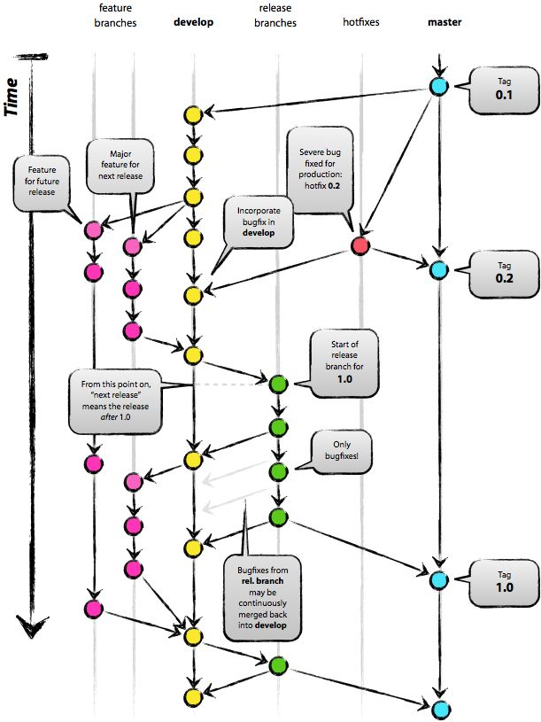

## Git 工作流程

#### 项目采用 “**版本发布**” 的模式，使用git-flow的工作流程

- **工作流程图如下**

#### 一、长期存在两个分支

- `master `主分支 （用于存放对外发布的版本， 存放稳定的发布版）

- `develop `开发分支 （用于日常开发，存放最新的开发版）

  git创建`develop`分支的命令：`git checkout -b develop master`

  ---

#### 二、短期分支

- `feature` 功能分支

- `release` 预发分支

- ``fixbug`` 修补bug分支

  这三种分支都属于临时性需要，使用完以后，应该删除，使得代码库的常设分支始终只有master和develop

  ---

#### **三、功能分支**

**当拿到一个需求应该从 `develop` 开一个分支出来，完成这部分工作, 完成后合并到 `develop` 分支。**

功能分支的名字，采用**feature-* **的形式命名。如 **feature-demo**

---

#### **四、预发分支**

**发布正式版本之前（即合并到master分支之前），我们可能需要有一个预发布的版本进行测试**

预发布分支是从develop分支上面分出来的，预发布结束以后，必须合并进develop和master分支。它的命			  	名采用release-*的形式。如： **release-1.2**

---

#### **五、补丁分支**

**正式发布以后出现bug需要创建一个分支，进行bug修补**

修补bug分支是从master分支上面分出来的。修补结束以后，再合并进master和develop分支。它的命名采用fixbug-*的形式。如： **fixbug-0.1**

---

日志规范

#### 六、补充

