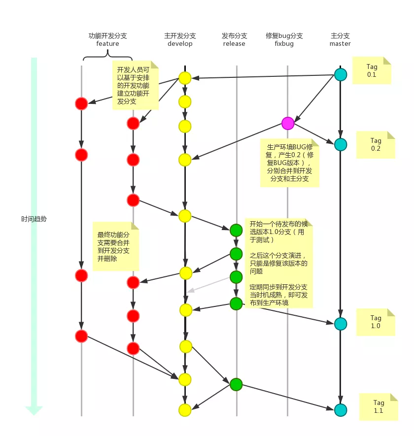
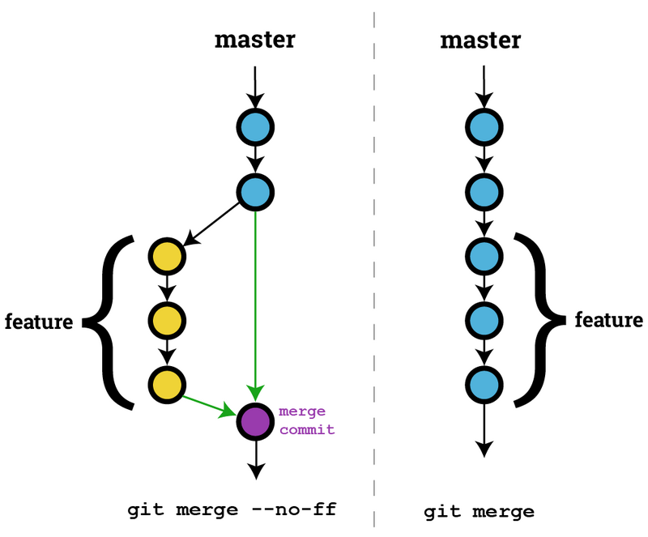

## Git 分支策略

#### 项目采用 “**版本发布**” 的模式，使用git-flow的工作流程

- **工作流程图如下**




#### 一、长期存在两个分支

- `master `主分支 （用于存放对外发布的版本， 存放稳定的发布版）

- `develop `开发分支 （用于日常开发，存放最新的开发版）

  git创建`develop`分支的命令：`git checkout -b develop master`

  ---


#### 二、短期分支

- `feature` 功能分支

- `release` 预发分支

- ``fixbug`` 修补bug分支

  这三种分支都属于临时性需要，使用完以后，应该删除，使得代码库的常设分支始终只有master和develop

  ---


#### **三、功能分支**

**当拿到一个需求应该从 `develop` 开一个分支出来，完成这部分工作, 完成后合并到 `develop` 分支。**

功能分支的名字，采用**feature-* **的形式命名。如 ：**feature-demo**

---


#### **四、预发分支**

**发布正式版本之前（即合并到master分支之前），我们可能需要有一个预发布的版本进行测试**

预发布分支是从`develop`分支上面分出来的，预发布结束以后，必须合并进`develop`和`master`分支。命名采用release-*的形式。如： **release-1.2**

---


#### **五、修补bug分支**

**正式发布以后出现bug需要创建一个分支，进行bug修补**

修补bug分支是从`master`分支上面分出来的。修补结束以后，再合并进`master`和`develop`分支。命名采用fixbug-*的形式。如： **fixbug-0.1**

---

#### 

#### 六、git合并模式



- **non fast-forward**。 不使用fast-forward方式合并，保留分支的commit历史。

- **fast-forward 快进式合并**。 git直接把HEAD指针指向合并分支的头，完成合并。这种情况如果删除分支，则会丢失分支信息。因为在这个过程中没有创建commit。

---


#### 七、 git常用命令

- git创建develop分支的命令：

  ```
  git checkout -b develop master
  ```

  

- 将develop分支发布到master分支的命令：

  ```
  # 切换到master分支
  git checkout master
  # 对develop分支进行合并
  git merge --no-ff develop
  ```

- 创建一个功能分支：

  ```
  git checkout -b feature-x develop
  ```

  开发完成后，将功能分支合并到develop分支：

  ```
  git checkout develop
  git merge --no-ff feature-x
  ```

  删除feature分支：

  ```
  git branch -d feature-x
  ```

- 创建一个预发布分支：

  ```
  git checkout -b release-1.2 develop
  ```

  确认没有问题后，合并到master分支：

  ```
  git checkout master
  git merge --no-ff release-1.2
  # 对合并生成的新节点，做一个标签
  git tag -a 1.2
  ```

  再合并到develop分支：

  ```
  git checkout develop
  git merge --no-ff release-1.2
  ```

  最后，删除预发布分支：

  ```
  git branch -d release-1.2
  ```

- 创建一个修补bug分支：

  ```
  git checkout -b fixbug-0.1 master
  ```

  修补结束后，合并到master分支：

  ```
  git checkout master
  git merge --no-ff fixbug-0.1
  git tag -a 0.1.1
  ```

  再合并到develop分支：

  ```
  git checkout develop
  git merge --no-ff fixbug-0.1
  ```

  最后，删除"修补bug分支"：

  ```
  git branch -d fixbug-0.1
  ```

---


#### 八、多人协作的工作模式

首先，可以试图用git push origin branch-name推送自己的修改；

如果推送失败，则因为远程分支比你的本地更新，需要先用git pull试图合并；

如果合并有冲突，则解决冲突，并在本地提交；

没有冲突或者解决掉冲突后，再用git push origin branch-name推送就能成功！

如果git pull提示“no tracking information”，则说明本地分支和远程分支的链接关系没有创建，用命令git branch --set-upstream branch-name origin/branch-name。

---


#### 参考资料

- [git教程](https://www.liaoxuefeng.com/wiki/896043488029600)
- [常用git命令清单](http://www.ruanyifeng.com/blog/2015/12/git-cheat-sheet.html)
- [三种git工作流程](http://www.ruanyifeng.com/blog/2015/12/git-workflow.html)
- [git分支策略](http://www.ruanyifeng.com/blog/2012/07/git.html)

